# ownCloud Quickstart Guide

## Introduction

Welcome to the ownCloud quick start guide. ownCloud is free and open-source file synchronization and sharing solution. ownCloud provides accessibility through web browsers, Android and iOS app or a desktop client(Linux, MacOS, Windows). This guide explains how to install and configure ownCloud server as an administrator. It further explores on the ways you can access ownCloud server once it has been installed and configured as a admin or an user.

## Prerequisites 

ownCloud requires a web server, a database, and a PHP version to function properly. To find detailed software prerequisites [click here](https://doc.owncloud.org/server/9.1/admin_manual/installation/source_installation.html#prerequisites-label). 

## Install and Configure ownCloud Server

To successfully install ownCloud server let us start by installing individual dependencies in following steps.

#### Enable Yum Repositories

Firstly, you need to enable REMI and EPEL yum repositories in your system. Use following command to install RHEL 7.

```
rpm -Uvh http://dl.fedoraproject.org/pub/epel/7/x86_64/Packages/e/epel-release-7-11.noarch.rpm
rpm -Uvh http://rpms.famillecollet.com/enterprise/remi-release-7.rpm
```

### Install LAMP stack

Ensure that you have up and running LAMP server, before installing ownCloud. If not please use the following commands to setup the LAMP server.

#### Install Apache

Use following command to install Apache.
```
yum --enablerepo=remi,epel install httpd
```

#### Install MySQL database

Run following commands to install MySQL database.
```
yum --enablerepo=remi,epel install mysql-server
service mysqld start
/usr/bin/mysql_secure_installation
```

#### Install PHP

Run following commands to install PHP.
```
yum --enablerepo=remi,epel install php php-mysql php-mcrypt php-curl php-gd php-xml php-dom php-mbstring
service httpd restart
```

### Download ownCloud Server Package

After successfully installing LAMP server, let us download the ownCloud from [here](https://owncloud.com/download-server/). To do this using terminal use following commands.
```
cd /var/www/html
wget https://download.owncloud.org/community/owncloud-complete-20201216.tar.bz2	
```

To extract downloaded tar file under website document root and setup appropriate permissions on files and directories use following commands.
```
tar xjf owncloud-10.4.0.tar.bz2
chown -R apache.apache owncloud
chmod -R 755 owncloud
```

### MySQL Database Configuration

To get started, log into MySQL with the administrative account with following command:
```
mysql -u root -p
```

Enter the password you set for the MySQL root user when you installed the database server. ownCloud requires a separate database for storing administrative data. For the purpose of this guide, we’ll name the database as ownCloud in following commands.
```
mysql> CREATE DATABASE owncloud;
```
Next, create a separate MySQL user account to interact with the newly created database.
```
mysql> GRANT ALL ON owncloud.* to 'owncloud'@'localhost' IDENTIFIED BY '_password_';
````
> Caution: Be sure to replace '_password_' with an actual password of your choice.

Run the flush privileges command to reload the grant tables in the MySQL database enabling the changes to take effect without reloading or restarting MySQL and then quit the session to conclude MySQL configuration.
```
mysql> FLUSH PRIVILEGES;
mysql> quit
```

### ownCloud Configuration

Now that we have installed ownCloud our next step would be to configure ownCloud. To do this access the ownCloud directory on the web browser as below. Don’t forget to change localhost to your server IP address or domain name if you have a different one.
```
http://localhost/owncloud/
```
You should see something like this:

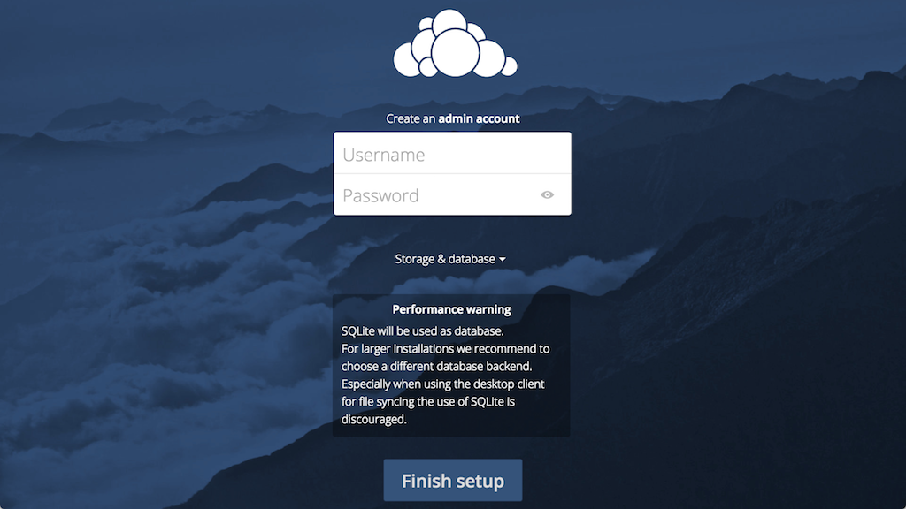

To create an admin account choose a username and password of your choice, and click on the Storage & database option to provide the location of the data folder.

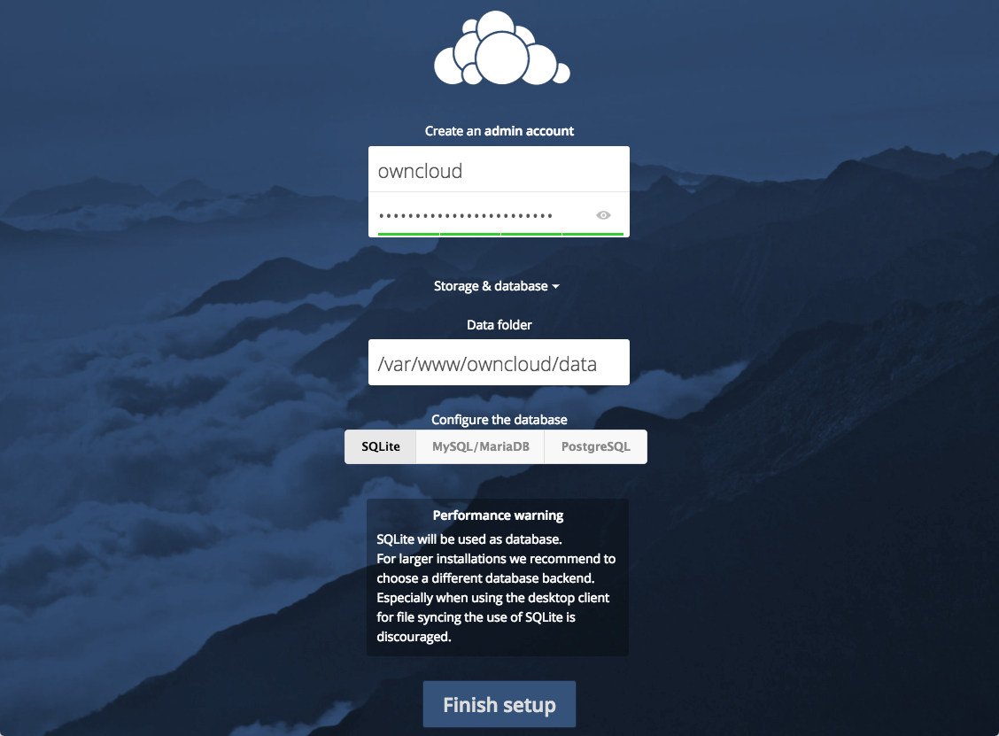

Do not change the Data folder setting. Click the MySQL/MariaDB button in the Configure the database section as shown below.


Now enter the database information that configured in the MySQL database configuration step as shown below.

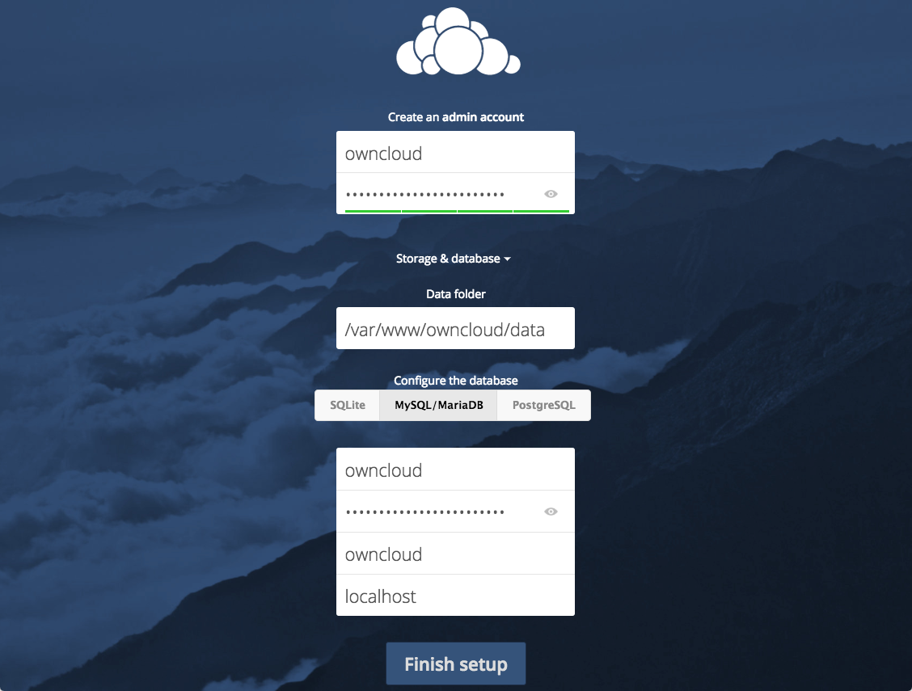

Click on the **Finish setup** and you should be directed to the ownCloud admin dashboard. Here you can create users, groups and assign them permissions.

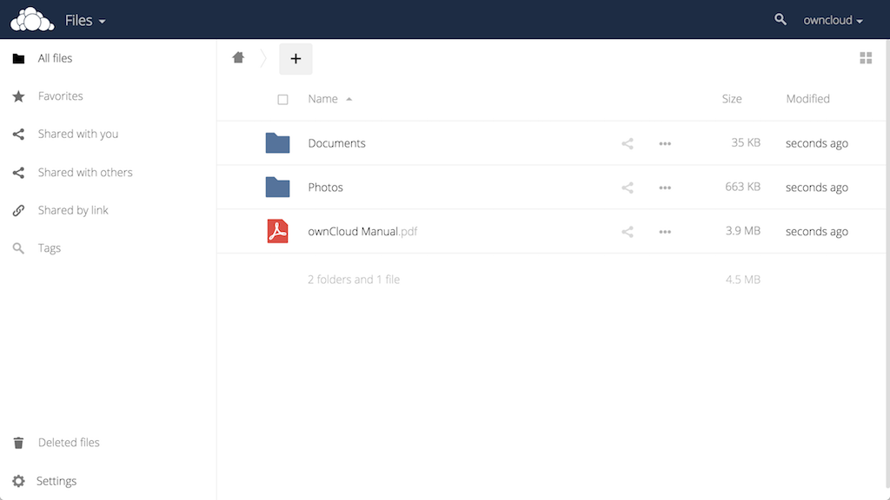

## Adding a New User account

Now that you have logged in as an administrator, click on your username on the top right-hand corner of the screen to open a drop-down menu and click on **Users**.
 To add new user account : 
   *	Enter a username and password for the new user.
   
   *	Optionally, you can add users to the existing groups or to a new group.
   
   *	Click the **Create** button
   
 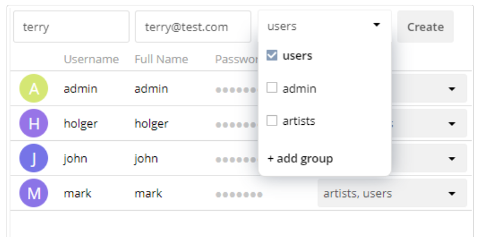 
 
## Connect to ownCloud Server
### Desktop Client

To connect to ownCloud server using desktop client you will need to download the appropriate ownCloud desktop client from [https://owncloud.com/desktop-app/](https://owncloud.com/desktop-app/). Once your download has completed, run the installer for the ownCloud desktop client.

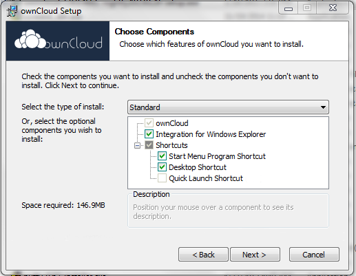 

After installing the client, authenticate your ownCloud server with correct IP address.

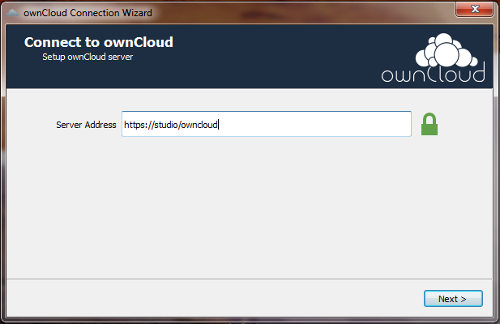 

Enter your user credentials and click on **Next**.

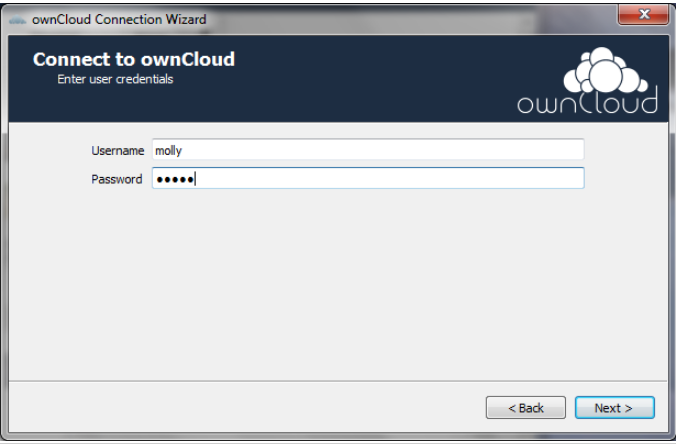

Here you can choose your synchronization preferences as shown below and finally click Connect to get connected to the ownCloud Server.

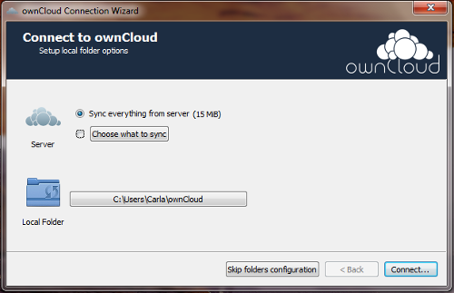

### Mobile Client

ownCloud also provides smartphones apps for Android and iOS platform. You can download these apps by following [https://owncloud.com/mobile-apps/](https://owncloud.com/mobile-apps/). Once you have installed and open the app for the first time you will be shown a configuration screen. Here you need to enter your server URL, login name, password and click on **Connect**.

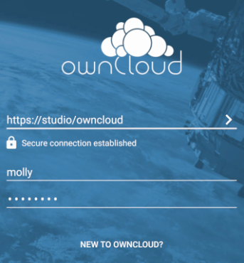

The ownCloud Android App will perform authentication once you enter the credentials. In case your server has a self-signed SSL certificate, you’ll get a warning that it is not to be trusted. When this happens, click the **YES** button to accept the certificate and complete your account setup.

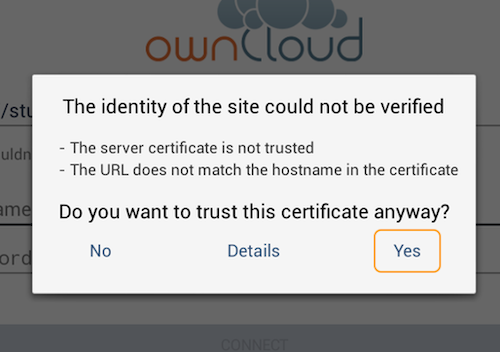

Now, your ownCloud Android app is ready to use. In the ownCloud Android app screen that appears, click the main menu to manage the core functionalities:

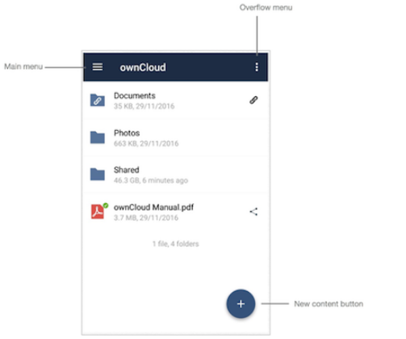
